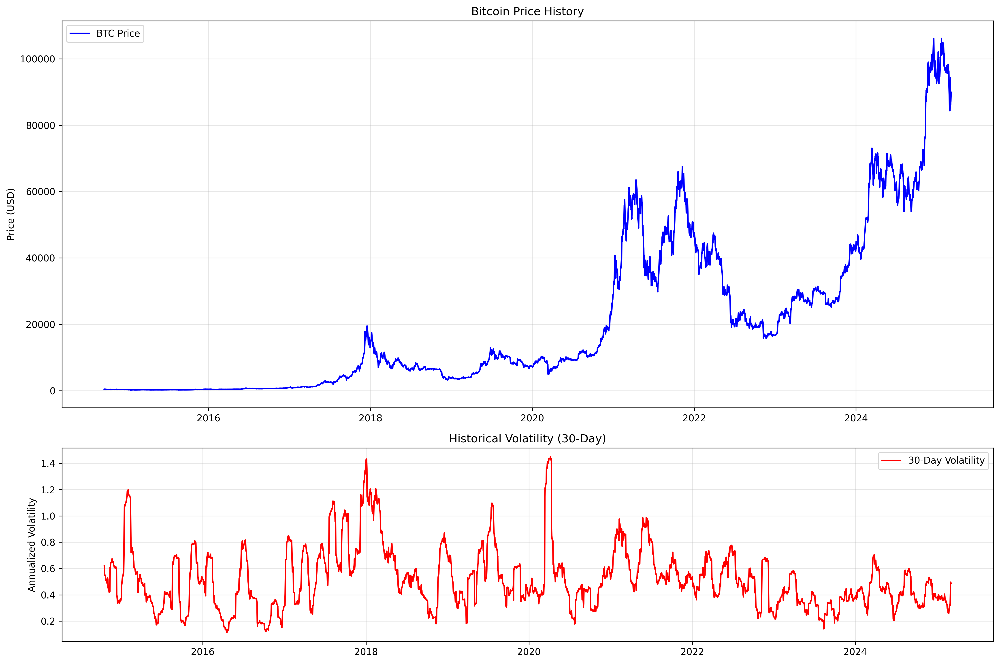
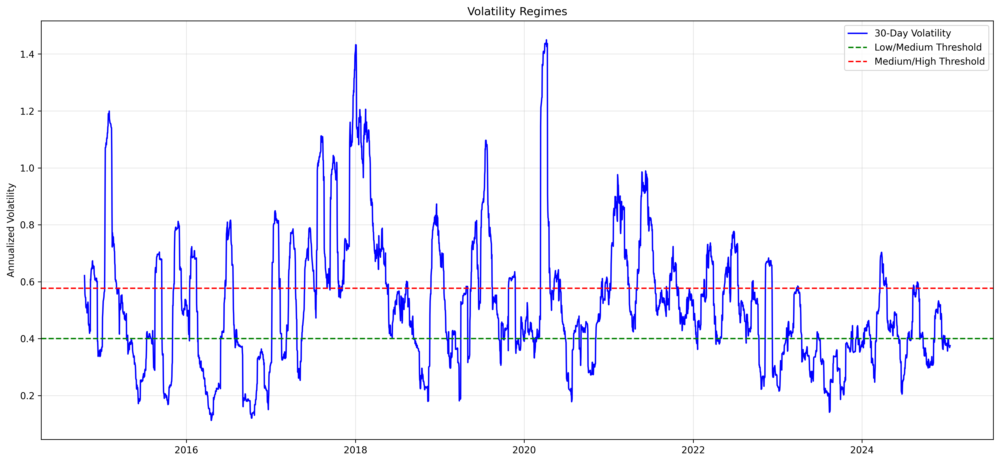
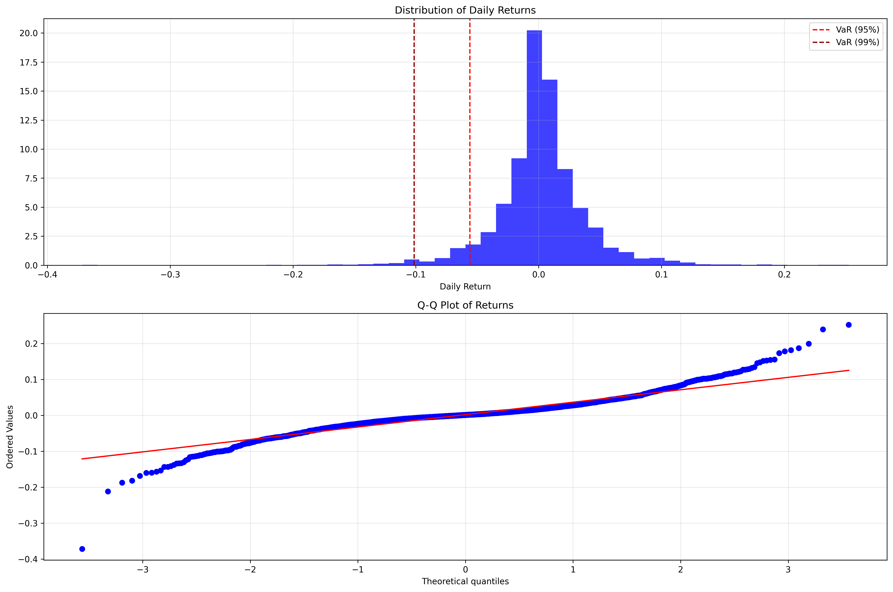
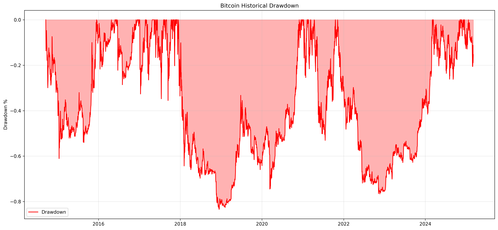
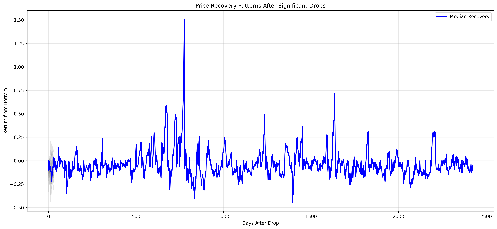
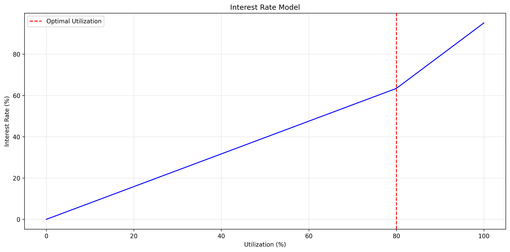

# Bitcoin Risk Analysis Report for Yala Protocol
Generated: 2025-02-19 12:46:08

## 1. Market Analysis

### Price and Volatility Trends

The above graph shows Bitcoin's price history and its 30-day rolling volatility. Key observations:
- Current annualized volatility: 57.40%
- Historical price patterns show cyclical volatility regimes

### Volatility Regime Analysis

The volatility regime analysis identifies three distinct market states:
- Low volatility: < 40.18%
- Medium volatility: 40.18% - 74.63%
- High volatility: > 74.63%

## 2. Risk Analysis

### Return Distribution

Key risk metrics:
- Value at Risk (95%): -5.60%
- Value at Risk (99%): -10.13%
- Annualized Volatility: 57.40%

### Drawdown Analysis

### Recovery Patterns

The analysis of recovery patterns shows:
- Median recovery time after significant drops
- Pattern of price rebounds
- Typical recovery trajectories

## 3. Protocol Parameters

### Interest Rate Model

Recommended protocol parameters:
- Initial LTV: 63.53%
- Liquidation threshold: 68.53%
- Base interest rate: 28.70%

## 4. Risk Management Recommendations

1. Dynamic Parameters
   - Adjust LTV based on volatility regimes
   - Implement graduated liquidation thresholds
   - Use adaptive interest rates

2. Risk Monitoring
   - Track volatility regime changes
   - Monitor drawdown patterns
   - Analyze recovery metrics

3. Safety Measures
   - Multi-stage liquidation process
   - Grace period for margin calls
   - Emergency circuit breakers
